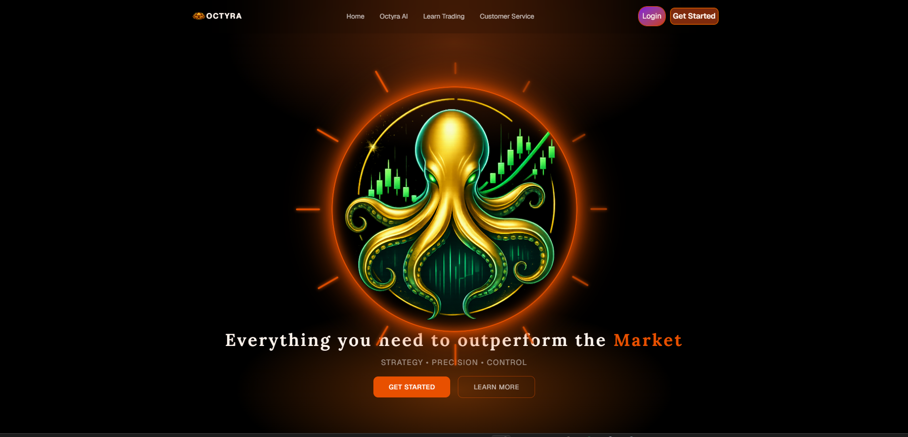
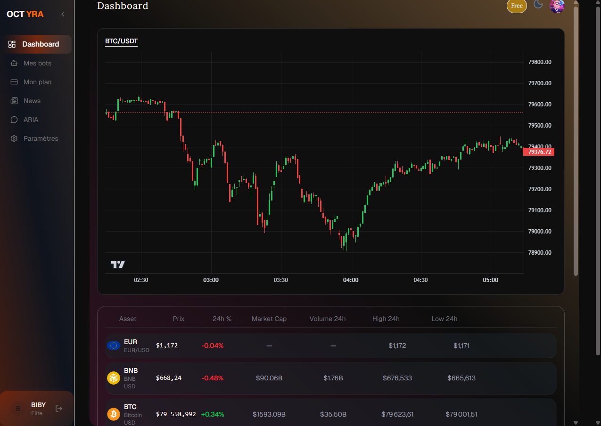
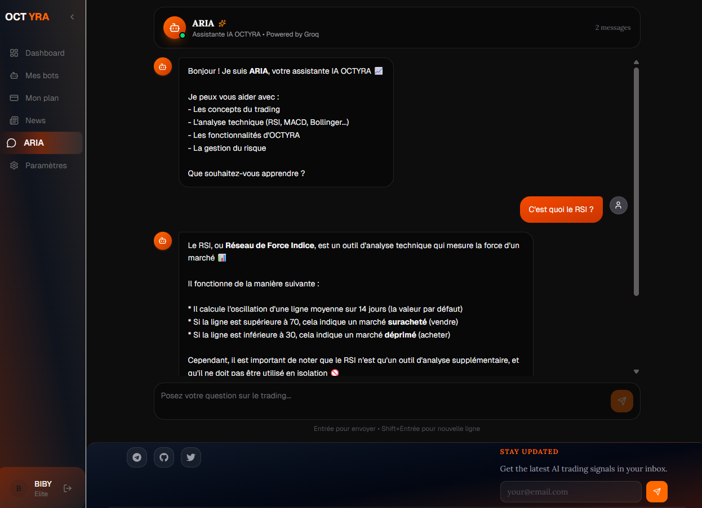

<div align="center">

# 🐙 OCTYRA — Intelligent Trading Platform

**Precision. Intelligence. Performance.**

[](https://octyra.pages.dev)
[](https://fastapi.tiangolo.com)
[](https://nextjs.org)
[](https://supabase.com)
[](https://upstash.com)

</div>

---

## 🌐 Live Demo

👉 **[https://octyra.pages.dev](https://octyra.pages.dev)**

---

## 📸 Screenshots

| Landing Page | Dashboard | ARIA Chat |
|:---:|:---:|:---:|
|  |  |  |

---

## ✨ Features

- 📊 **Real-time prices** — BTC, ETH, SOL, Forex, Gold, Oil via WebSocket
- 🤖 **ARIA AI Assistant** — Powered by Groq LLM for trading insights
- 📈 **ML Signals** — XGBoost + Random Forest BUY/SELL/HOLD predictions
- 🔔 **Trading Bots** — Automated strategies
- 📰 **Market News** — Real-time financial news
- 🔐 **JWT Auth** — Secure authentication
- 💰 **Plans** — Free, Pro, Elite tiers

---

## 🛠️ Tech Stack

### Backend
| Technology | Usage |
|---|---|
| **FastAPI** | REST API + WebSockets |
| **PostgreSQL** | Primary database (Supabase) |
| **Redis** | Cache + broker (Upstash) |
| **Celery** | Background tasks |
| **XGBoost + scikit-learn** | ML trading signals |
| **Groq API** | AI chat (ARIA) |
| **yfinance + CCXT** | Market data |

### Frontend
| Technology | Usage |
|---|---|
| **Next.js 15** | React framework |
| **TypeScript** | Type safety |
| **Tailwind CSS + DaisyUI** | Styling |
| **Framer Motion** | Animations |

### Infrastructure
| Service | Usage |
|---|---|
| **Render** | Backend hosting |
| **Cloudflare Pages** | Frontend hosting |
| **Supabase** | PostgreSQL |
| **Upstash** | Redis |
| **UptimeRobot** | Monitoring |

---

## 🚀 Local Setup

### Backend
```bash
git clone https://github.com/kevinrakoto53-code/Octyra-trade_backend
cd Octyra-trade_backend
python -m venv venv
venv\Scripts\activate
pip install -r requirements.txt
uvicorn main:app --reload
```

### Frontend
```bash
git clone https://github.com/kevinrakoto53-code/Octyra-trade_frontend
cd Octyra-trade_frontend
npm install
npm run dev
```

---

## 👨‍💻 Author

**Kevin Rakoto**
- GitHub: [@kevinrakoto53-code](https://github.com/kevinrakoto53-code)
- Email: kevinrakoto53@gmail.com
- Live: [octyra.pages.dev](https://octyra.pages.dev)

---

<div align="center">

Built with ❤️ for smarter trading

⭐ **Star this repo if you found it useful!**

</div>